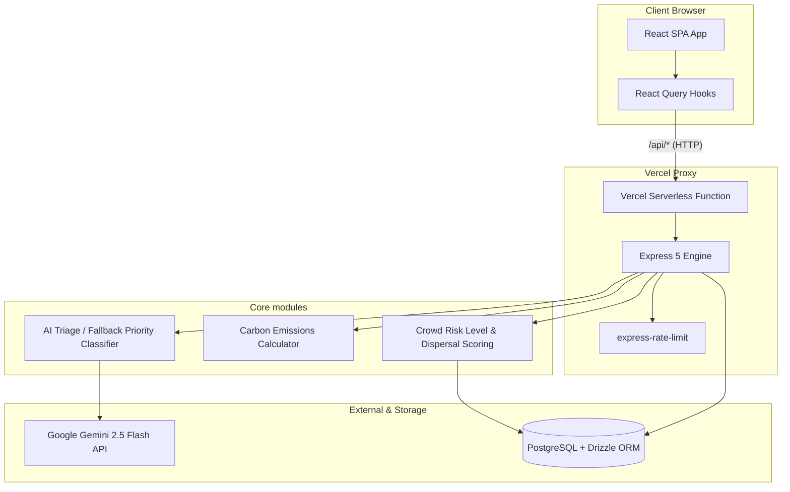

# 🏟️ StadiumAI — FIFA World Cup 2026

[](https://vercel.com)
[](https://www.typescriptlang.org/)
[](https://react.dev/)
[](https://vitest.dev/)

A **GenAI-enabled Stadium Operations & Fan Engagement Platform** designed for the FIFA World Cup 2026 across all 16 stadiums in the USA, Canada, and Mexico. It provides unified, role-based interfaces for fans, organizers, volunteers, and venue staff.

---

## 🏗️ System Architecture

StadiumAI is built as a highly modular **pnpm workspace monorepo**, ensuring complete separation of concerns and robust security boundaries.

### Architecture Data Flow



---

## 🌟 Key Features & Role-Based Portals

StadiumAI provides a customized dashboard for every stakeholder in the stadium operations lifecycle:

| Portal | Audience | Key Functionality | AI Integration |
| :--- | :--- | :--- | :--- |
| **📣 Fan Portal** | General Spectators | Interactive stadium map, navigation, live crowd warnings, and instant **SOS button**. | Multilingual support, accessibility routing queries. |
| **📈 Operations Dashboard** | Venue Commanders | Real-time incident logs with priority badges, emergency management panels, and status summaries. | AI-assisted incident triage & critical level classification. |
| **🤝 Volunteer Hub** | Active Event Staff | Shift logs, venue zone assignments, real-time occupancy meters, and operations guidance. | Real-time volunteer task assistant. |
| **🌱 Sustainability Tracker** | Green Officers | Multi-modal carbon savings analytics, public transit recommendations, and green metrics. | Automated translation of eco broadcasts. |

---

## 📂 Codebase Directory Map

```ini
├── api/
│   └── index.ts                # Vercel serverless function wrapper
├── artifacts/
│   ├── api-server/             # Express 5 backend server
│   │   ├── src/lib/            # Pure, testable business logic functions
│   │   └── src/routes/         # Express API route handlers
│   └── stadium-ai/             # React + Vite frontend application
│       └── src/pages/          # FanPortal, OpsDashboard, VolunteerHub, etc.
├── lib/
│   ├── api-client-react/       # Generated React Query hooks (via Orval)
│   ├── api-spec/               # OpenAPI 3.0 spec (OpenAPI contract-first)
│   ├── api-zod/                # Generated Zod validation schemas
│   └── db/                     # PostgreSQL Drizzle database configuration
├── tests/                      # Consolidated unit test suite (Vitest)
└── vercel.json                 # Vercel edge/rewrite routing config
```

---

## 🛠️ Local Development & Operations

Ensure you have **Node.js v24+** and **pnpm** installed.

### 1. Install Workspace Dependencies
```bash
pnpm install
```

### 2. Run the Frontend (Dev mode)
```bash
pnpm --filter @workspace/stadium-ai run dev
```

### 3. Run the API Server (Dev mode)
```bash
pnpm --filter @workspace/api-server run dev
```

### 4. Run the Full Test Suite
Runs all 118 unit tests covering prompt-building, crowd classification, priority triage, and carbon metrics.
```bash
pnpm run test
```

### 5. Codebase Checks & Builds
Verify types and build production bundles for all packages:
```bash
pnpm run typecheck
pnpm run build
```

---

## 🚀 Vercel Deployment Guide

This project is configured to run out-of-the-box on **Vercel** as a combined Serverless Backend + Static Frontend deployment.

1. **Import the repository** in Vercel.
2. In the Vercel dashboard project settings, configure the following:
   - **Framework Preset**: `Other`
   - **Build Command**: `pnpm run build`
   - **Output Directory**: `artifacts/stadium-ai/dist/public`
3. Configure the **Environment Variables**:
   - `DATABASE_URL`: Your production PostgreSQL connection string.
   - `GEMINI_API_KEY`: Your Google Gemini API key (safely accessed only server-side).
